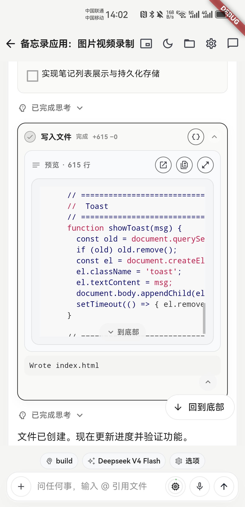
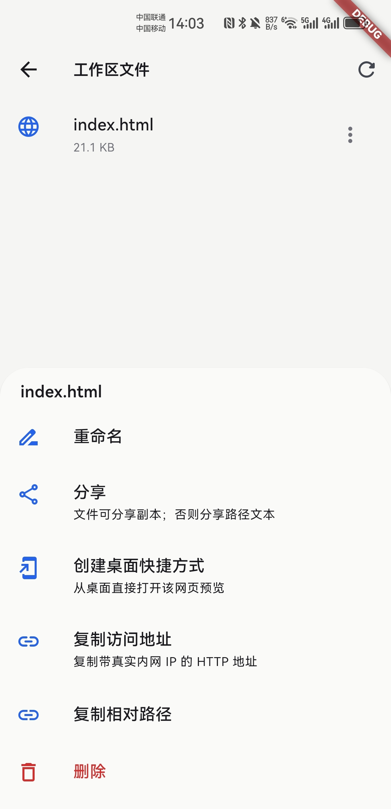
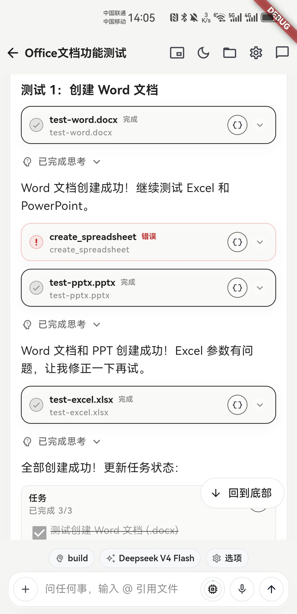
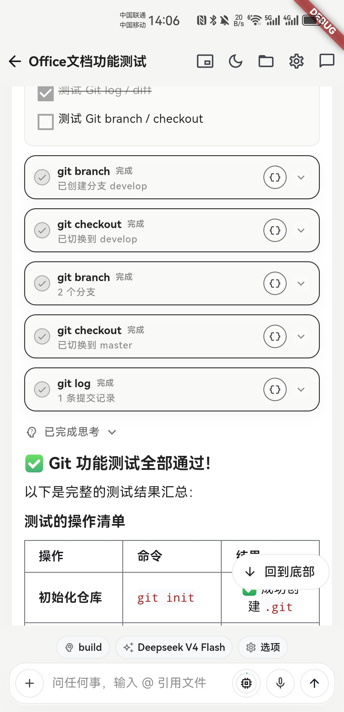

# Mag

**Mag** is an open-source mobile AI coding agent. It gives an agent a real workspace on your phone: projects, sessions, files, Git, Office document generation, native media capture, model providers, MCP, Skills, permissions, and mobile mini-window runtime.

[Watch the demo video](docs/assets/mag-app-demo.mp4) · [Read the docs](docs/README.md) · [中文介绍](#中文介绍)

## Preview

  
  
  

  
  

## Why Mag

Most mobile AI apps stop at chat. Mag is built around work:

- Open a project and keep session history tied to that workspace.
- Let the agent read, search, edit, patch, generate files, and explain tool calls.
- Review Git changes, manage branches/remotes, and sync from a phone.
- Generate DOCX, XLSX, and PPTX files fully on device.
- Capture photos, record audio, record video, and pass media into prompts.
- Keep sensitive actions explicit through permission cards and local state.

## What It Can Do

| Area | Highlights |
|------|------------|
| Workspace | Recent projects, sandbox projects, file browser, previews, attachments, and `@` references. |
| Agent sessions | Session drawer, new/switch/rename/delete, auto-title, stop/cancel, compaction, and project memory hooks. |
| Models | Provider setup, API keys, model discovery, recent models, context usage, tags, and OpenAI-compatible endpoints. |
| Tools | Read/write/edit/patch, search, move/copy/delete/rename, variables, web fetch/download, todos, questions, MCP, and Skills. |
| Office generation | Create DOCX reports, XLSX workbooks, and PPTX decks from structured content. |
| Git | Init/clone, status/diff/log/show, stage/commit/amend, branches, restore/reset/merge/rebase/cherry-pick, remotes, fetch/pull/push, identity, SSH keys, and credentials. |
| Native media | Pick files, take photos, record audio, record video, save, and share through Android/iOS bridges. |
| AI web runtime | AI-generated HTML can call `window.MagNative` for files, camera, audio, and video capture. |
| Mobile runtime | Android floating window, foreground service, background notification, mini/line/full overlay modes, and iOS PiP-style foundation. |
| Local first | SQLite-backed sessions, messages, permissions, todos, questions, local preferences, loopback HTTP APIs, and SSE-style events. |

## Documentation

| Start Here | Description |
|------------|-------------|
| [Quickstart](docs/quickstart.md) | Install, run, configure a model, and start the first project. |
| [Features](docs/features.md) | Product capability map for users and contributors. |
| [User Guide](docs/user-guide.md) | End-user workflows across projects, sessions, files, media, Git, and mini-window. |
| [Document Generation](docs/document-generation.md) | DOCX, XLSX, and PPTX generation tools with examples and boundaries. |
| [AI Web Runtime](docs/web-runtime.md) | Native capabilities exposed to generated HTML pages. |
| [Architecture](docs/architecture.md) | Runtime layers, event flow, persistence, native bridges, and extension points. |
| [AI Tools](docs/ai-tools.md) | Tool reference, permissions, path rules, and generated artifacts. |
| [Development](docs/development.md) | Local setup, test commands, native notes, and debugging. |
| [Release](docs/release.md) | Packaging, signing, and release checklist. |
| [Materials Needed](docs/materials-needed.md) | Screenshots, videos, branding, and examples needed to polish the project page. |

## Project Status

Mag is actively evolving. The current focus is making mobile agent workflows practical: trustworthy tool execution, local-first state, native mobile capabilities, and documentation good enough for users and contributors to onboard without private context.

## Contributing

Issues and pull requests are welcome. Start with [CONTRIBUTING.md](CONTRIBUTING.md), keep changes focused, and update docs when user-visible behavior changes.

## Security

Do not commit API keys, signing files, `android/key.properties`, credentials, or private workspace data. Report vulnerabilities through [SECURITY.md](SECURITY.md).

## 中文介绍

**Mag** 是一个开源的移动端 AI 编程 Agent。它不是手机聊天框，而是一个真正的移动端 Agent 工作台：项目、会话、文件、Git、Office 文档生成、拍照/录音/录像、模型服务商、MCP、Skills、权限体系和移动端小窗运行时都整合在一起。

核心能力包括：

- 在手机上创建项目、管理会话、浏览和预览工作区文件。
- 让 Agent 读写代码、搜索、打补丁、下载、提问、管理待办。
- 生成 DOCX 报告、XLSX 表格和 PPTX 演示文稿。
- 在应用内拍照、录音、录制视频，并作为 prompt 附件交给 Agent。
- 在手机上完成 Git 查看、暂存、提交、分支、同步和凭据管理。
- 通过 Android 悬浮窗或 iOS PiP 风格基础能力继续观察运行中的任务。

从 [快速开始](docs/quickstart.md) 进入，完整文档见 [docs/README.md](docs/README.md)。

## License

Mag is released under the [MIT License](LICENSE).
