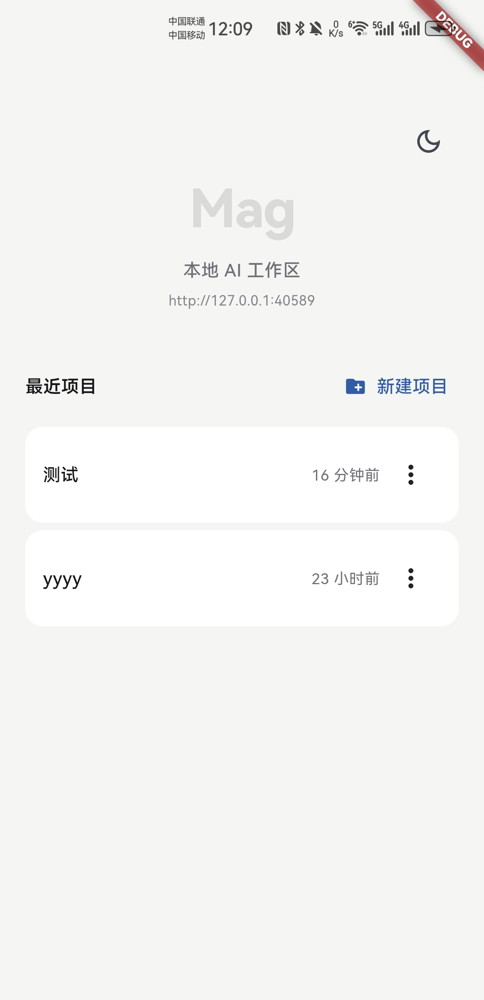
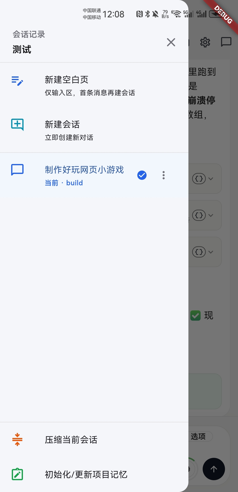
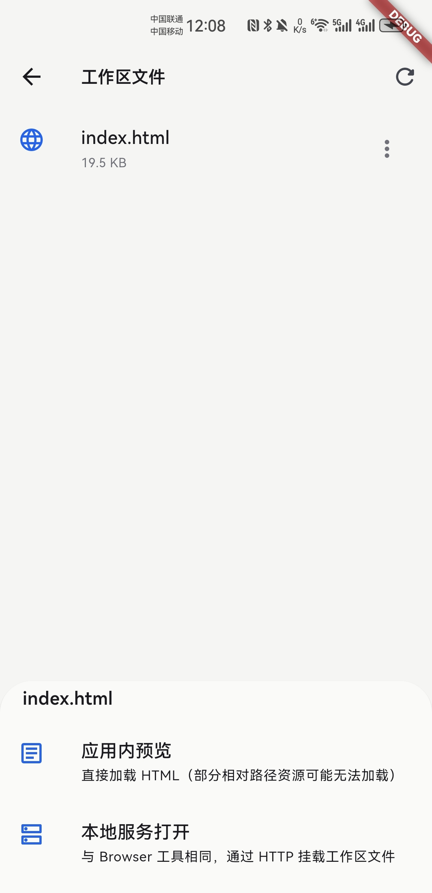
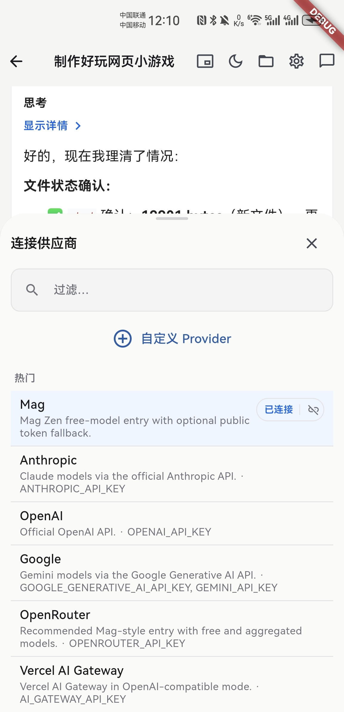
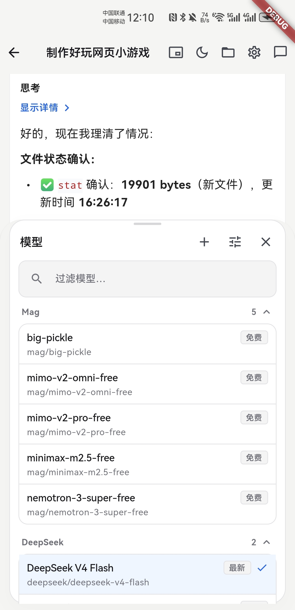
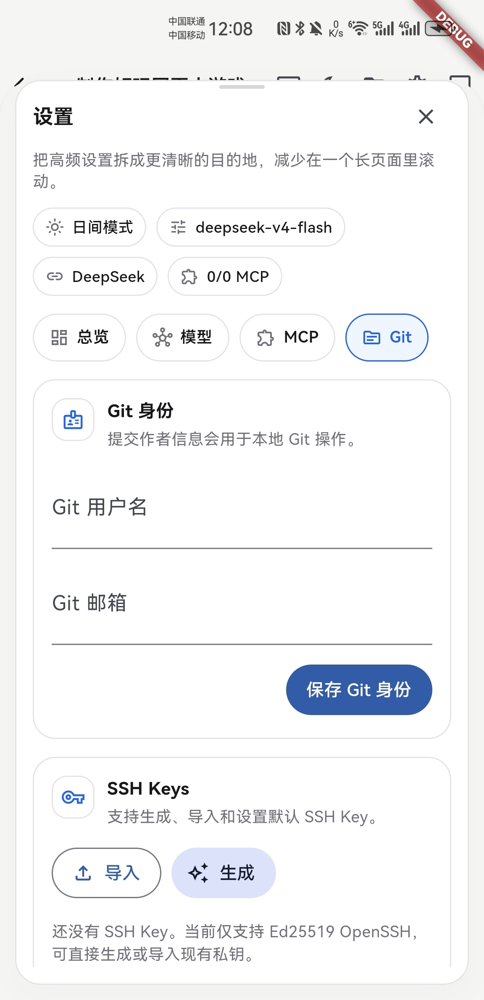
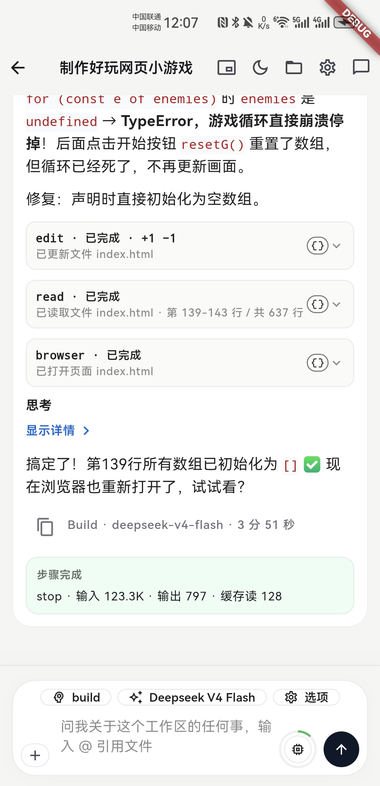

# User guide

How to use **Mag** on your device. This complements in-app UI labels (Chinese / English).

## First launch

1. Open the app.
2. From the **project home**, create a new project or open an existing recent project.
3. Grant permissions when prompted. Notification permission is used for background status; overlay permission is used only for the Android floating window.
4. You land on the **agent page** for that workspace.

  

## Project home

- **Recent projects** — Reopen projects stored in the app sandbox.
- **New project** — Create a sandbox project and enter its agent page.
- **Rename / delete** — Manage local project entries from the project list menu.

## Chat screen (workspace)

### Top bar

| Control | Action |
|---------|--------|
| Back | Return to **project home** (workspace session is left; data stays on device). |
| Title | Current session title (or “New session” on the blank landing page). |
| Folder | **Workspace file browser** — browse folders, open files (Markdown/HTML preview vs source, PDF, images, code). |
| Settings | Model provider, API keys, and related options. |
| Chat bubble | **Session drawer** — history, new session, compact, project memory, rename/delete sessions. |

### New session landing

When no session is active, the page stays on a blank landing state. The first message creates a session. You can also use the session drawer to create a session immediately.

  

### Sessions

- **Default titles** follow an OpenCode-style pattern (`New session - <UTC ISO>`). After the **first real user message**, the app may **auto-generate a short title** via the model (only for main sessions, not child/subtask titles).
- **Rename / delete** — Use the ⋮ menu on a session row in the drawer. Deleting the active session returns you to the blank landing state.
- **Switch sessions** — Open the drawer and tap another session. Mag reloads messages and status for that session.
- **Compact / project memory** — Long-running projects can use compaction and memory-oriented actions from the drawer/settings area when available.

### File browser

- Navigate with folder rows; **Parent folder** goes up one level.
- **Refresh** reloads the directory from the device.
- **Markdown / HTML** can be opened as rendered preview or source.
- **PDF / images / text / code** use dedicated previews where supported.
- File paths shown to tools are relative to the workspace root.

  

### Composer

- Type a prompt and send it to create or continue a session.
- Use `@` to reference workspace files when suggestions are available.
- Add attachments from workspace files when the action is enabled.
- After sending a message, the keyboard is dismissed so the timeline stays visible.

### Models and providers

- Open **Settings** to connect a model provider and configure API keys.
- For the current provider/model ecosystem, see [models.dev](https://models.dev).
- When supported, Mag can discover available models from the provider.
- Recent models and current model context usage are shown in the UI.
- Some tool behavior is adapted to model/provider capabilities.
- Custom OpenAI-compatible endpoints can be used for gateways, proxies, local models, or self-hosted services.

  
  
  

### Git

Git is part of the project workflow, not a separate desktop-only step.

- Configure Git identity, SSH keys, and remote credentials in **Settings**.
- Use Git features to inspect status and diffs before committing.
- Stage paths, commit, amend, manage branches, and sync with remotes.
- Advanced operations include restore, reset, merge, rebase, and cherry-pick.
- Android uses a native JGit bridge; iOS uses a native libgit2 bridge.

### While the agent runs

- **Stop / cancel** follows the session lifecycle (busy state in the title area).
- **Permissions** — Some tools ask for allow/deny/always; replies are tied to the workspace.
- **Tool calls** appear in the message stream so you can see what the agent is doing.
- **Reasoning / text / tool summaries** are displayed in chronological order where the UI supports it.
- **Background notification** appears when an active session keeps running while the app goes to the background.

  

### MCP and Skills

- MCP tools let the agent list/read remote resources and list/resolve prompt templates from configured MCP servers.
- Skills let the agent load reusable task instructions from built-in or workspace-local skill directories.
- Workspace skill locations include `.opencode/skill`, `.opencode/skills`, `.claude/skills`, and `.agents/skills`.
- Loading a Skill adds instructions and references to the conversation; it does not secretly execute scripts.

### Mobile mini-window

Mag includes native mobile mini-window behavior for monitoring an active session while using other apps.

- The mini-window button is available only on supported mobile platforms.
- It is disabled until there is an active session with messages.
- Android requires **Display over other apps** permission before the overlay can appear.
- Android uses a system overlay and foreground service.
- iOS uses a Picture-in-Picture style foundation on supported systems.
- Android supports **mini**, **line**, and **full** display modes.
- The full mode can show status, assistant content, Markdown tables, reasoning text, and tool call summaries.
- The window can be dragged/closed/scrolled where the platform allows, and tapped to return to Mag.
- When the mini-window starts successfully, Mag can move to the background so the overlay/PiP remains visible.

### Permissions

| Permission | Why It Is Needed |
|------------|------------------|
| Notifications | Shows background running status and floating-window foreground service status on Android 13+. |
| Display over other apps | Shows the Android floating window. |
| File/project access | Lets Mag read, preview, and edit files in the selected project workspace. |
| Tool permissions | Lets you approve sensitive agent actions such as file edits, web fetch/download, or environment-file access. |

---

## 中文用户指南

### 首次使用

1. 打开应用。
2. 在**项目首页**新建项目，或打开已有的最近项目。
3. 按提示授予权限。通知权限用于后台状态提示；悬浮窗权限只用于 Android 小窗。
4. 进入该工作区的 **Agent 页面**。

  

### 项目首页

- **最近项目** — 快速打开保存在应用沙盒中的项目。
- **新建项目** — 创建沙盒项目并进入 Agent 页面。
- **重命名 / 删除** — 在项目列表菜单中管理本地项目。

### 对话页顶栏

| 控件 | 作用 |
|------|------|
| 返回 | 回到**项目首页**（离开当前工作区界面，数据仍保留在本机）。 |
| 标题 | 当前会话标题（空白落地页时为「新建会话」等）。 |
| 文件夹 | **工作区文件** — 浏览目录；支持 Markdown/HTML（排版/源码）、PDF、图片、代码高亮等。 |
| 设置 | 模型服务商、API Key 等。 |
| 会话图标 | **会话抽屉** — 历史、新建、压缩、项目记忆、重命名/删除会话。 |

### 新会话落地页

没有活跃会话时，页面会停留在空白落地状态。发送第一条消息会创建会话，也可以从会话抽屉中立即新建会话。

  

### 会话与标题

- 默认标题为 OpenCode 风格；**首条用户消息**后，主会话可能由模型**自动生成短标题**（子会话不自动改标题）。
- 在抽屉列表 ⋮ 中可**重命名 / 删除**；删除当前会话会回到**空白落地页**。
- 在抽屉中点击其他会话可切换；Mag 会重新加载对应消息和状态。
- 长会话可使用压缩、项目记忆等能力（具体入口以当前 UI 为准）。

### 文件浏览器

- 点击文件夹进入；**上级目录**返回上一层。
- **刷新**强制重新读取目录。
- Markdown / HTML 支持以渲染视图或源码视图打开。
- PDF、图片、文本、代码会在支持时进入对应预览。
- 工具看到的文件路径均相对工作区根目录。

  

### 输入区

- 输入提示词并发送，可创建或继续会话。
- 输入 `@` 可引用工作区文件（有可用建议时）。
- 在入口可用时，可以从工作区选择附件。
- 消息发送后会自动收起软键盘，方便继续查看消息流。

### 模型与供应商

- 在**设置**中连接模型供应商并配置 API Key。
- 当前模型和供应商生态可参考 [models.dev](https://models.dev)。
- 在供应商支持时，Mag 可以发现可用模型。
- UI 会展示最近使用模型和当前模型上下文用量。
- 部分工具行为会根据模型/供应商能力做适配。
- 自定义 OpenAI-compatible endpoint 可用于接入网关、代理、本地模型或自托管服务。

  
  
  

### Git

Git 是项目工作流的一部分，不是必须回到桌面端才能做的事情。

- 在**设置**中配置 Git identity、SSH key 和 remote credential。
- 提交前可以查看 status 和 diff。
- 支持暂存路径、提交、amend、管理分支、与远程同步。
- 高级操作包括 restore、reset、merge、rebase、cherry-pick。
- Android 使用原生 JGit 桥接；iOS 使用原生 libgit2 桥接。

### Agent 运行时

- 标题区域会显示运行状态，可按会话生命周期停止/取消。
- 某些工具会弹出允许/拒绝/始终允许等权限确认，回答与当前工作区相关。
- 工具调用会出现在消息流中，便于观察 Agent 正在做什么。
- 在支持的 UI 中，推理、正文和工具摘要会按原始顺序展示。
- 有活跃会话时进入后台，会显示后台运行通知。

  

### MCP 与 Skills

- MCP 工具让 Agent 可以从配置的 MCP Server 列出/读取远程资源，并列出/解析 Prompt 模板。
- Skills 让 Agent 加载可复用的任务说明，来源可以是内置 Skill 或工作区本地 Skill。
- 工作区 Skill 目录包括 `.opencode/skill`、`.opencode/skills`、`.claude/skills`、`.agents/skills`。
- 加载 Skill 只会把说明和参考资料加入上下文，不会偷偷执行脚本。

### 移动端小窗

Mag 提供原生移动端小窗能力，用于在切换到其他应用时继续观察活跃会话。

- 小窗按钮只在支持的平台显示。
- 没有活跃会话或没有消息时，小窗按钮不可用。
- Android 需要授予**显示在其他应用上层**权限。
- Android 使用系统悬浮窗和前台服务。
- iOS 在支持的系统上使用 Picture-in-Picture 风格基础能力。
- Android 小窗支持**迷你**、**单行**、**完整**三种模式。
- 完整模式可展示状态、助手内容、Markdown 表格、推理文本和工具调用摘要。
- 平台允许时，小窗支持拖拽、关闭、滚动、点击回到 Mag。
- 小窗成功打开后，Mag 可自动退到后台，让悬浮窗/PiP 保持可见。

### 权限说明

| 权限 | 用途 |
|------|------|
| 通知 | Android 13+ 上显示后台运行状态和小窗前台服务状态。 |
| 显示在其他应用上层 | 显示 Android 小窗。 |
| 文件/项目访问 | 让 Mag 读取、预览和编辑当前项目工作区中的文件。 |
| 工具权限 | 让用户确认文件编辑、网页获取/下载、环境文件访问等敏感 Agent 操作。 |
